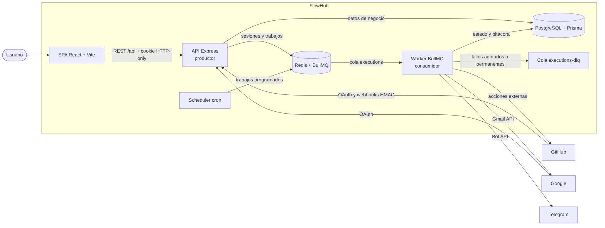

# FlowHub — Proyecto 02

**Aplicaciones Web Utilizando Software Libre (ISW-811)**

- **Estudiantes:** Edgar Eliam Araya Alvarado · Jose Pablo Chavez Madriz · Robert
- **Docente:** Misael Matamoros Soto
- **Fecha:** 24/07/2026

FlowHub es una plataforma de automatización personal donde el usuario define reglas
del tipo “cuando ocurra X, haz Y”.

Este repositorio contiene **toda la solución**: la API productora, el worker consumidor
y el frontend web. Aunque comparten repositorio, la API y el worker son **procesos
independientes**, con su propio comando y su propio contenedor.

## Componentes

| Componente | Carpeta | Responsabilidad | Tecnología |
|---|---|---|---|
| API (productor) | `src/api/` | Autenticación, OAuth, webhooks, CRUD y publicación de trabajos | Express + Prisma + BullMQ |
| Worker (consumidor) | `src/worker/` | Consume la cola y ejecuta las acciones de los proveedores | Node.js + BullMQ |
| Frontend | `web/` | Interfaz SPA que consume la API | React + Vite |
| Código compartido | `src/shared/` | Prisma, Redis, colas y cifrado de tokens | — |

## Arquitectura

Principio central: **la API no ejecuta acciones externas dentro de una petición HTTP**.
Valida la solicitud, persiste el estado necesario, publica un trabajo en Redis y responde.
El worker, como proceso separado, consume ese trabajo después.



El diagrama está escrito con [Mermaid](https://github.com/mermaid-js/mermaid), por lo que
GitHub lo renderiza directamente y sus cambios pueden revisarse como texto en cada commit.

### Contratos internos

- **Frontend → API:** HTTP JSON bajo `/api`, con cookies y `credentials: "include"`.
- **API → worker:** cola BullMQ `executions` en la instancia definida por `REDIS_URL`.
- **API y worker → base de datos:** PostgreSQL mediante Prisma, con el mismo esquema.
- **Adaptadores del worker:** firma acordada
  `async ({ params, connection, context }) => resultado`.

Un cambio en el payload de la cola afecta a la API y al worker: debe documentarse aquí.

## Alcance actual

La solución implementa actualmente:

- Express con seguridad básica, CORS, sesiones y manejo central de errores.
- Endpoint de salud `GET /api/health`.
- Registro, sesiones, OAuth, conexiones, CRUD de automatizaciones, webhooks y consulta de
  ejecuciones bajo `/api`.
- Publicador BullMQ para la cola `executions`, con reintentos y backoff predeterminados.
- Worker consumidor con idempotencia, condiciones, interpolación, reintentos, scheduler,
  adaptadores de proveedores y derivación a la cola de fallidos (`executions-dlq`).
- Frontend React + Vite con autenticación, conexiones OAuth, CRUD de automatizaciones y
  bitácora de ejecuciones.
- PostgreSQL 16 y Redis 7 para desarrollo con Docker Compose.
- Esquema y migración inicial de Prisma.
- Proveedores `GOOGLE`, `GITHUB` y `TELEGRAM`.
- Modelo `TriggerState` para conservar el cursor del polling de Gmail.

El polling de Gmail continúa pendiente; no debe presentarse como funcional durante la defensa.

## Estructura del repositorio

```text
.
├── docker-compose.yml        # postgres y redis; perfil "app" para toda la solución
├── Dockerfile                # imagen del backend: sirve para la API y el worker
├── .env.example
├── package.json
├── prisma/
│   ├── schema.prisma
│   └── migrations/
├── src/
│   ├── api/                  # productor
│   │   ├── index.js
│   │   └── routes/
│   ├── worker/               # consumidor
│   │   ├── index.js
│   │   └── engine.js
│   ├── shared/               # usado por la API y el worker
│   │   ├── prisma.js
│   │   ├── queue.js
│   │   ├── redis.js
│   │   └── session.js        # sesiones persistidas en Redis
│   └── config.js
└── web/                      # frontend React + Vite
    ├── Dockerfile
    ├── nginx.conf
    └── src/
```

## Instalación local

Esta modalidad ejecuta PostgreSQL y el broker Redis en Docker, mientras la API, el worker y
la web se ejecutan con Node.js. Para levantar todo con Docker, seguir
[Ejecución completa en contenedores](#ejecución-completa-en-contenedores).

### Requisitos

- Node.js 20 LTS o superior y npm.
- Docker Desktop con contenedores Linux y el motor iniciado.
- Git.

Comprobar las versiones:

```bash
node --version
npm --version
docker --version
docker compose version
docker info
```

`docker info` debe mostrar las secciones `Client` y `Server`. En Windows, si el comando
indica que no encuentra `dockerDesktopLinuxEngine`, iniciar Docker Desktop desde el menú
Inicio o ejecutar `docker desktop start`, esperar y volver a probar.

### 1. Clonar el repositorio

```bash
git clone <url-del-repositorio>
cd Codexa
```

### 2. Instalar dependencias

El lockfile está versionado para que todos usen las mismas versiones:

```bash
npm ci
npm run web:install
```

El primer comando instala las dependencias del backend (API y worker); el segundo, las
del frontend en `web/`.

### 3. Configurar el entorno

macOS/Linux:

```bash
cp .env.example .env
```

PowerShell:

```powershell
Copy-Item .env.example .env
```

Generar los secretos:

```bash
# 64 caracteres hexadecimales
node -e "console.log(require('crypto').randomBytes(32).toString('hex'))"

# secreto largo para las sesiones
node -e "console.log(require('crypto').randomBytes(48).toString('base64'))"
```

Copiar esos resultados en `TOKEN_ENCRYPTION_KEY` y `SESSION_SECRET` dentro de `.env`.
Las credenciales OAuth pueden permanecer vacías si todavía no se probarán las conexiones.
Cada integrante debe crear sus propias credenciales; nunca se comparte ni versiona el archivo
`.env`. La guía detallada está en [oauth_tutorial.md](oauth_tutorial.md).

### Configurar OAuth de GitHub

1. En GitHub, abrir **Settings → Developer settings → OAuth Apps → New OAuth App**.
2. Usar `http://localhost:5173` como *Homepage URL* y
   `http://localhost:4000/api/oauth/github/callback` como *Authorization callback URL*.
3. Copiar el Client ID y generar un Client Secret; guardarlos únicamente en `.env` como
   `GITHUB_CLIENT_ID` y `GITHUB_CLIENT_SECRET`.
4. Mantener `GITHUB_OAUTH_SCOPES=public_repo`, suficiente para crear issues en repositorios
   públicos. Usar `repo` solo si la demostración necesita repositorios privados.

### Configurar OAuth de Google

1. Crear o elegir un proyecto en Google Cloud Console y habilitar **Gmail API**.
2. Configurar la pantalla de consentimiento, agregar los integrantes como usuarios de prueba
   y declarar el scope `https://www.googleapis.com/auth/gmail.modify`.
3. Crear un cliente OAuth de tipo **Web application** con el redirect URI
   `http://localhost:4000/api/oauth/google/callback`.
4. Guardar el Client ID y Secret únicamente en `.env` como `GOOGLE_CLIENT_ID` y
   `GOOGLE_CLIENT_SECRET`.

Después de cambiar credenciales en el perfil Docker, reconstruir/recrear la API con
`docker compose --profile app up -d --build`. En desarrollo local basta reiniciar `npm run dev`.

La configuración local usa el puerto `5433` para PostgreSQL, evitando conflictos con una
instalación nativa que use el puerto convencional `5432`. Dentro del contenedor PostgreSQL
continúa escuchando en `5432`; no hay que cambiar esa parte.

### 4. Levantar PostgreSQL y Redis

Redis es el **broker** compartido: la API publica trabajos BullMQ en `executions`, el worker
los consume y los fallos definitivos se registran en `executions-dlq`.

```bash
docker compose up -d --wait
docker compose ps
docker compose port postgres 5432
docker compose port redis 6379
```

Ambos servicios deben aparecer como `healthy`. El comando de PostgreSQL debe mostrar el puerto
`5433`, por ejemplo `0.0.0.0:5433`; Redis usa `6379` de forma predeterminada.

### 5. Aplicar la base de datos

```bash
npm run prisma:deploy
npm run prisma:generate
```

`prisma:deploy` debe indicar que aplicó la migración inicial o que no hay migraciones
pendientes. `prisma:generate` puede mostrar un aviso sobre una nueva versión mayor de Prisma;
no es necesario actualizarla para instalar el proyecto.

### 6. Ejecutar los tres procesos

Cada uno en su propia terminal:

```bash
npm run dev:api
```

```bash
npm run dev:worker
```

```bash
npm run dev:web
```

- API: http://localhost:4000
- Frontend: http://localhost:5173

Verificar la API:

```bash
curl http://localhost:4000/api/health
```

Respuesta esperada:

```json
{"status":"ok","service":"flowhub-api"}
```

En PowerShell también se puede usar:

```powershell
Invoke-RestMethod http://localhost:4000/api/health
```

El frontend debe mostrar **“API conectada”**. El worker debe imprimir
`Worker de FlowHub escuchando la cola executions`.

## Ejecución completa en contenedores

Además del modo de desarrollo, toda la solución puede levantarse en Docker mediante el
perfil `app`:

```bash
docker compose --profile app up -d --build --wait
docker compose --profile app ps
```

Esto construye y arranca cinco contenedores: `postgres`, `redis`, `api`, `worker` y `web`
(más `migrate`, que aplica las migraciones y termina). El frontend queda en
http://localhost:8080 y nginx reenvía `/api` al contenedor de la API.

La API y el worker se construyen desde la **misma imagen** pero corren en contenedores
distintos con comandos distintos: son procesos independientes y desplegables por separado,
como exige el enunciado.

Para detener solo la aplicación y dejar la infraestructura:

```bash
docker compose stop api worker web
```

`docker compose --profile app down` también detiene PostgreSQL y Redis; usarlo únicamente
cuando se quiera apagar toda la solución.

## Notas de integración

### Frontend

En desarrollo, `VITE_API_URL` se deja **vacío**: el proxy de Vite reenvía `/api` al backend,
por lo que el navegador ve un solo origen y no hay problemas de CORS ni de cookies.

El puerto del frontend está fijado con `strictPort: true` porque debe coincidir con `WEB_URL`
del `.env` (por defecto `http://localhost:5173`). Si Vite cambiara de puerto en silencio,
todas las peticiones fallarían por CORS.

Las peticiones que dependan de la sesión deben incluir `credentials: "include"`.
Las sesiones se almacenan en Redis, por lo que sobreviven al reinicio de la API y pueden
compartirse entre varias instancias del backend.

### Worker

Comparte el `.env` de la raíz con la API, así que no requiere configuración adicional.
Consume la cola `executions` y, cuando un trabajo agota sus reintentos, lo deriva a
`executions-dlq`.

`TOKEN_ENCRYPTION_KEY` es la misma para ambos: la API cifra los tokens OAuth y el worker
los descifra para llamar a los proveedores.

## Variables de entorno

| Variable | Obligatoria para arrancar | Uso |
|---|---:|---|
| `PORT` | No | Puerto HTTP de la API, por defecto `4000` |
| `WEB_URL` | No | Origen permitido por CORS |
| `DOCKER_WEB_URL` | No | Origen del frontend en Docker, por defecto `http://localhost:8080` |
| `PUBLIC_URL` | Más adelante | URL pública para callbacks y webhooks |
| `POSTGRES_PORT` | No | Puerto de PostgreSQL en el host, por defecto `5433` |
| `REDIS_PORT` | No | Puerto de Redis en el host, por defecto `6379` |
| `WORKER_CONCURRENCY` | No | Trabajos simultáneos del worker, por defecto `5` |
| `DATABASE_URL` | Sí | Conexión PostgreSQL |
| `REDIS_URL` | Sí | Redis compartido entre API y worker |
| `SESSION_SECRET` | Sí | Firma de la sesión |
| `TOKEN_ENCRYPTION_KEY` | Para OAuth | Cifrado AES-256 de tokens |
| `GOOGLE_*` | Para OAuth Google | Credenciales y callback |
| `GITHUB_*` | Para OAuth/webhooks | Credenciales, callback y firma |
| `GITHUB_OAUTH_SCOPES` | No | `public_repo` por defecto; usar `repo` solo para repositorios privados |
| `TELEGRAM_BOT_TOKEN` | Para el worker | Ejecución de acciones Telegram |

El frontend tiene su propia plantilla en `web/.env.example` con `VITE_API_URL`.

## Scripts

| Comando | Acción |
|---|---|
| `npm run dev:api` | API con recarga automática |
| `npm run dev:worker` | Worker con recarga automática |
| `npm run dev:web` | Frontend en modo desarrollo |
| `npm run start:api` / `start:worker` | Ejecución sin recarga |
| `npm run web:install` | Instalar dependencias del frontend |
| `npm run web:build` | Compilar el frontend |
| `npm test` | Ejecutar las pruebas automatizadas con Node.js Test Runner |
| `npm run prisma:generate` | Generar Prisma Client |
| `npm run prisma:migrate -- --name descripcion` | Crear una migración |
| `npm run prisma:deploy` | Aplicar migraciones versionadas |
| `npm run prisma:studio` | Explorar la base de datos |
| `npm run oauth:verify-storage` | Verificar que los tokens OAuth estén cifrados en reposo |
| `npm run enqueue:test-job` | Publicar un trabajo de prueba en el broker |
| `npm run verify:worker-flow` | Verificar el flujo API → cola → worker |
| `npm run security:audit-history` | Buscar firmas de secretos en todo el historial Git sin mostrar sus valores |

## Auditoría de secretos

Ejecutar antes de entregar o crear el PR final:

```bash
npm run security:audit-history
```

El comando revisa todas las referencias y commits, no solo el árbol actual. Por diseño imprime
únicamente el tipo de hallazgo y su ubicación `commit:archivo`; nunca imprime el secreto.
El resultado y cualquier remediación pendiente se documentan en
[SECURITY_AUDIT.md](SECURITY_AUDIT.md).

## Webhooks durante el desarrollo

Exponer el puerto de la API y copiar la URL pública en `PUBLIC_URL`:

```bash
ngrok http 4000
# o
cloudflared tunnel --url http://localhost:4000
```

Callback Google:

```text
http://localhost:4000/api/oauth/google/callback
```

Callback GitHub:

```text
http://localhost:4000/api/oauth/github/callback
```

La pantalla **Conexiones** inicia ambos flujos. Los callbacks validan `state` y PKCE antes de
guardar access/refresh tokens cifrados con AES-256-GCM. Para evidenciar el cifrado en reposo,
conectar una cuenta, ejecutar `npm run prisma:studio`, abrir `Connection` y comprobar que los
campos terminan en un valor con formato `v1:...`, nunca en el token legible. No copiar esos
valores a capturas, issues ni mensajes.

Webhook GitHub:

```text
PUBLIC_URL/api/webhooks/github/<automationId>
```

## Solución de problemas

- Si `docker` existe pero no conecta con `dockerDesktopLinuxEngine`, iniciar Docker Desktop
  con `docker desktop start` y esperar a que `docker info` muestre la sección `Server`.
- Si Prisma no alcanza PostgreSQL, confirmar que `docker compose ps` muestre `healthy` y
  revisar el puerto real con `docker compose port postgres 5432`.
- Si Prisma muestra `P1000`, comprobar que `DATABASE_URL` coincida con usuario, contraseña
  y puerto de `.env`. También ejecutar `unset DATABASE_URL` en Git Bash para eliminar una
  variable antigua que pueda tener prioridad sobre el archivo.
- Si Prisma muestra `P1001`, el puerto de `DATABASE_URL` no coincide con el publicado por
  Docker Compose.
- Si la API indica variables faltantes, confirmar que `.env` existe en la raíz.
- Si el frontend recibe un error CORS, revisar que su origen coincida exactamente con `WEB_URL`.
- Si registro o login devuelve `CSRF_TOKEN_INVALID`, comprobar que el origen configurado use
  el mismo protocolo y host con el que se abre el frontend: `WEB_URL` para Vite y
  `DOCKER_WEB_URL` para Docker. Al desplegar con HTTPS debe comenzar con `https://`.
- Si el worker no recibe trabajos, comparar `REDIS_URL` y el nombre de cola en ambos repositorios.
- Si el puerto `5433` está ocupado, cambiar `POSTGRES_PORT` y el puerto de `DATABASE_URL`
  al mismo valor. No modificar el puerto interno `5432` del contenedor.

Comprobar las credenciales dentro del contenedor:

```bash
docker exec -e PGPASSWORD=flowhub flowhub-postgres \
  psql -h 127.0.0.1 -U flowhub -d flowhub -c "SELECT 1;"
```

Para detener la infraestructura sin borrar datos:

```bash
docker compose down
```

`docker compose down -v` elimina permanentemente los datos locales.

## Reglas de colaboración

- Ningún secreto se versiona; solo `.env.example`.
- Las migraciones de Prisma se crean y versionan desde este repositorio.
- Los cambios al payload de `executions` se coordinan con el equipo del worker.
- Los cambios de endpoints se coordinan con el equipo del frontend.
- Cada integrante trabaja en una rama por tarea y realiza commits con su propia cuenta.
